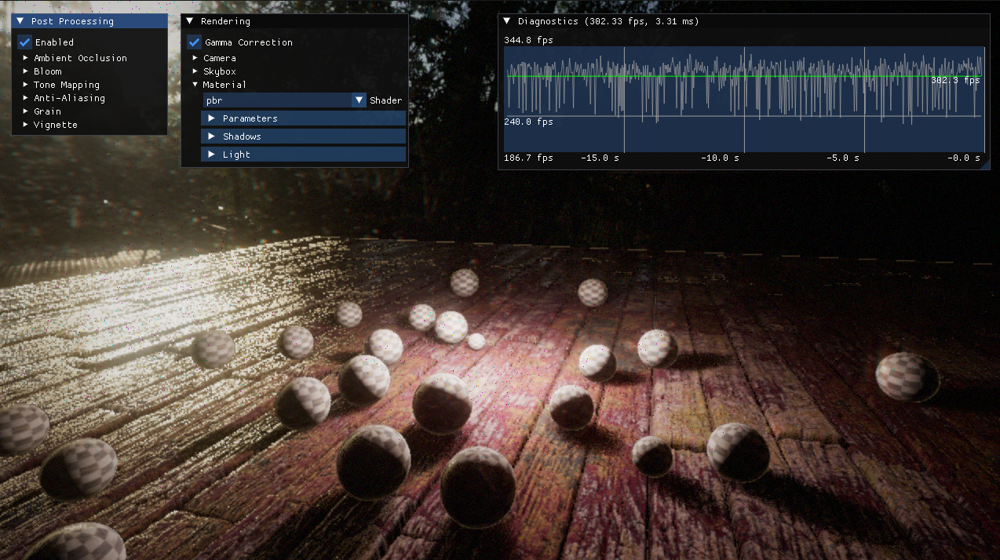
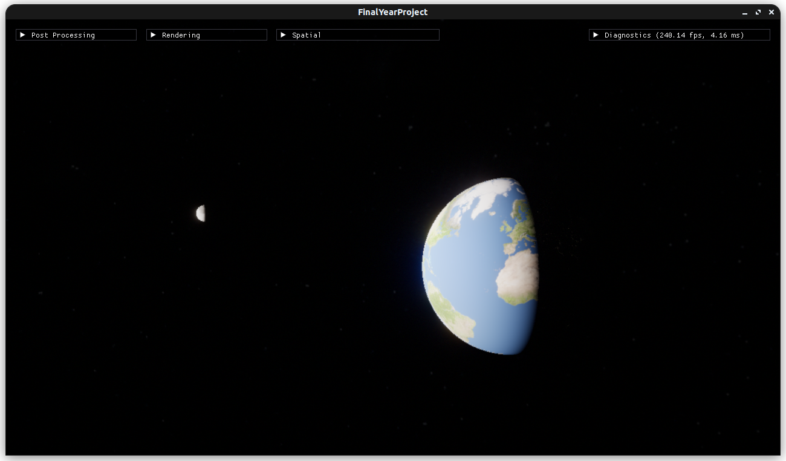
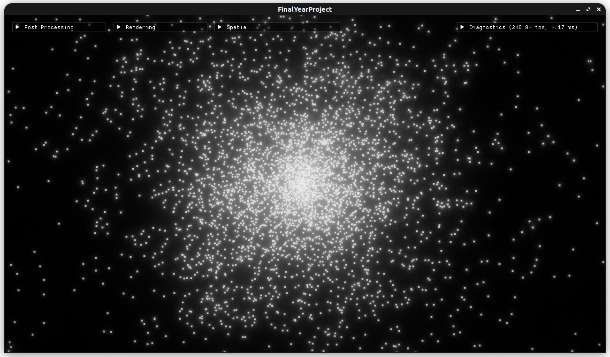
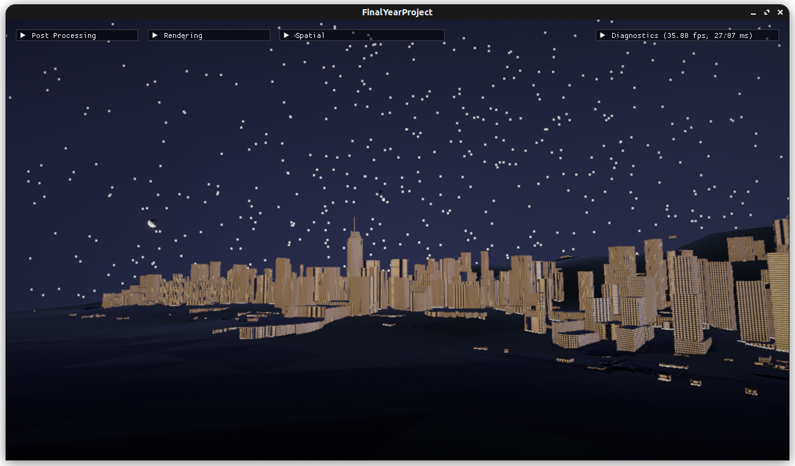
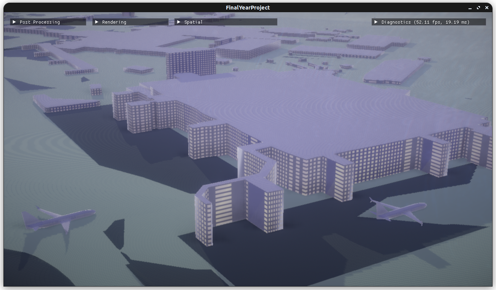
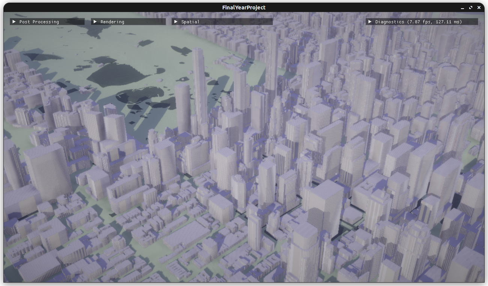

# Final Year Project



## Table of Contents

- [About](#About)
- [Features](#Features)
- [Instructions](#Instructions)
  - [Linux](#Linux)
  - [Windows](#Windows)
- [Dependencies](#Dependencies)
- [References](#References)

### About

This project represents the culmination of all the programming work I have completed throughout my (ongoing) final year at university.

It is an extension of my 3DGP assignment from second year, and is expected to undergo changes and transformations in the upcoming months as more additions and modifications are implemented.

If you are assessing this project, please refer to the [Dependencies](#Dependencies) and [References](#References) sections of this document for a comprehensive list of sources.

### Features

- Physically-Based Rendering Pipeline
- Full Post Processing Stack
- PCSS Shadows
- Physics with Bullet 3
- Entity Component System
- Concurrent Capabilities
- Networking Capabilities
- Multi-Platform Positional Audio Playback
- Multi-Platform Keyboard and Mouse Input
- GUI Implemented using IMGUI
- Custom GLSL Interpreter
- Resources System with Asset Streaming
- Passes Valgrind and Google Sanitizers

### Scenes

By default, the project comes with the following scenes:

### Engine Test


This scene contains a demonstration of the engine's core functionality, in a simple PBR-rendered environment.

### Planets



A to-scale simulation of the positions and rotations of the planets in the solar system. It updates in realtime according to the current date and time.

### Stars



A 3D visualisation of the stars in the ATHYG dataset, with Sol positioned in the centre.


### FYP





A 3D map of a user-defined location in the world. It features to-scale simulations of the stars, planets, sun, and moon in 3D, alongside 3D representations of nearby aircraft broadcasting their positions. The map updates in real time and is accurate to the current time and day.

*Map includes data reconstructed from [OpenStreetMap(c)](https://www.openstreetmap.org/copyright)*

### Build from Source

#### Linux

To minimise project size and simplify setup, the build system is able to link to the necessary packages if they are already installed on your system. You may need to install the following packages:

##### Debian-Based

```sudo apt-get install libsdl2-dev libglew-dev libopenal-dev libcurl4-openssl-dev libbullet-dev libassimp-dev```

#### Windows

Building for Windows is not yet supported. This will be added in the future.

### Dependencies

- [Bullet Physics 3.2.5](https://github.com/bulletphysics/bullet3)
- [cereal v1.3.2](https://uscilab.github.io/cereal/)
- [Dear ImGui v1.90 (IMGUI)](https://www.dearimgui.com/)
- [libcurl](https://curl.se/libcurl/)
- [mapbox/earcut.hpp v2.2.4](https://github.com/mapbox/earcut.hpp)
- [Open Asset Import Library (assimp) v5.4.0](https://github.com/assimp/assimp)
- [openal-soft-1.23.1](https://github.com/kcat/openal-soft/releases/tag/1.23.1)
- [OpenGL Extension Wrangler Library 2.1.0 (GLEW)](https://www.opengl.org/sdk/libs/GLEW/)
- [OpenGL Mathematics 0.9.9.8 (GLM)](https://www.opengl.org/sdk/libs/GLM/)
- [Simple Direct Media Layer v2.x (SDL2)](https://www.libsdl.org/index.php)
- [stb_image v2.27](https://github.com/nothings/stb/blob/master/stb_image.h)
- [vsop87-multilang](https://github.com/gmiller123456/vsop87-multilang)

### References

- Rabbid76 (2019). Adding Shadows to Parallax Occlusion Map. [online] Stack Overflow. Available at: https://stackoverflow.com/questions/55089830/adding-shadows-to-parallax-occlusion-map [Accessed 15 Dec. 2023].


- Cerisano, D. (2022). Random / noise functions for GLSL. [online] Stack Overflow. Available at: https://stackoverflow.com/questions/4200224/random-noise-functions-for-glsl [Accessed 15 Dec. 2023].


- Chernikov, Y. (2021). Bloom. [online] www.youtube.com. Available at: https://www.youtube.com/watch?v=tI70-HIc5ro [Accessed 15 Dec. 2023].


- de Vries, J. (n.d.). LearnOpenGL - Cubemaps. [online] learnopengl.com. Available at: https://learnopengl.com/Advanced-OpenGL/Cubemaps [Accessed 15 Dec. 2023].


- de Vries, J. (n.d.). LearnOpenGL - Gamma Correction. [online] learnopengl.com. Available at: https://learnopengl.com/Advanced-Lighting/Gamma-Correction [Accessed 15 Dec. 2023].


- de Vries, J. (n.d.). LearnOpenGL - Normal Mapping. [online] learnopengl.com. Available at: https://learnopengl.com/Advanced-Lighting/Normal-Mapping [Accessed 15 Dec. 2023].


- de Vries, J. (n.d.). LearnOpenGL - Parallax Mapping. [online] learnopengl.com. Available at: https://learnopengl.com/Advanced-Lighting/Parallax-Mapping [Accessed 15 Dec. 2023].


- de Vries, J. (n.d.). LearnOpenGL - Point Shadows. [online] learnopengl.com. Available at: https://learnopengl.com/Advanced-Lighting/Shadows/Point-Shadows [Accessed 15 Dec. 2023].


- de Vries, J. (n.d.). LearnOpenGL - Shadow Mapping. [online] learnopengl.com. Available at: https://learnopengl.com/Advanced-Lighting/Shadows/Shadow-Mapping [Accessed 15 Dec. 2023].


- de Vries, J. (n.d.). LearnOpenGL - SSAO. [online] learnopengl.com. Available at: https://learnopengl.com/Advanced-Lighting/SSAO [Accessed 15 Dec. 2023].


- Fernando, R. and NVIDIA Corporation (2005). Percentage-Closer Soft Shadows. [online] Available at: https://developer.download.nvidia.com/shaderlibrary/docs/shadow_PCSS.pdf [Accessed 15 Dec. 2023].


- Flick, J. (2018). FXAA. [online] catlikecoding.com. Available at: https://catlikecoding.com/unity/tutorials/advanced-rendering/fxaa/ [Accessed 15 Dec. 2023].


- JeGX (2009). How to Visualize the Depth Buffer in GLSL | Geeks3D. [online] Geeks3D. Available at: https://www.geeks3d.com/20091216/geexlab-how-to-visualize-the-depth-buffer-in-glsl/ [Accessed 15 Dec. 2023].


- Jimenez, J. (n.d.). LearnOpenGL - Phys. Based Bloom. [online] learnopengl.com. Available at: https://learnopengl.com/Guest-Articles/2022/Phys.-Based-Bloom [Accessed 15 Dec. 2023].


- Myers, K., Fernando , R., Bavoil, L. and NVIDIA Corporation (2008). Integrating Realistic Soft Shadows into Your Game Engine. [online] Available at: https://developer.download.nvidia.com/whitepapers/2008/PCSS_Integration.pdf [Accessed 15 Dec. 2023].


- Opsenica, B. (2019). Automatic Exposure Using a Luminance Histogram. [online] bruop.github.io. Available at: https://bruop.github.io/exposure/ [Accessed 15 Dec. 2023].


- Penov, F. and Slayden, G. (2016). image - Formula to determine perceived brightness of RGB color. [online] Stack Overflow. Available at: https://stackoverflow.com/questions/596216/formula-to-determine-perceived-brightness-of-rgb-color [Accessed 15 Dec. 2023].


- Siejak, M. (2018). /PBR/data/shaders/glsl/pbr_fs.glsl. [online] GitHub. Available at: https://github.com/Nadrin/PBR/blob/master/data/shaders/glsl/pbr_fs.glsl [Accessed 15 Dec. 2023].


- Taylor, M. (2019). Tone Mapping. [online] 64.github.io. Available at: https://64.github.io/tonemapping/ [Accessed 15 Dec. 2023].


- Schäfer, M., Strohmeier, M., Lenders, V., Martinovic, I. and Wilhelm, M., 2014. Bringing up OpenSky: A large-scale ADS-B sensor network for research. In: IPSN-14 Proceedings of the 13th International Symposium on Information Processing in Sensor Networks [online]. Presented at the IPSN-14 Proceedings of the 13th International Symposium on Information Processing in Sensor Networks, 83–94. Available from: https://ieeexplore.ieee.org/abstract/document/6846743 [Accessed 8 Apr 2024].


- Greg Miller, 2024. vsop87-multilang. [online]. Available from: https://github.com/gmiller123456/vsop87-multilang [Accessed 1 May 2024].


- Daniel Stenberg, n.d. libcurl - the multiprotocol file transfer library. [online]. Available from: https://curl.se/libcurl/ [Accessed 1 May 2024].


- OSM Foundation, 2024. OpenStreetMap. [online]. Available from: https://www.openstreetmap.org/copyright [Accessed 1 May 2024].


- João Ricardo Lourenço., 2024. OpenElevation. [online]. Available from: https://github.com/Jorl17/open-elevation/blob/master/docs/api.md [Accessed 1 May 2024].


- Andrew Nisbet, 2024. Open Topo Data. [online]. Available from: https://www.opentopodata.org/ [Accessed 1 May 2024].


- Archinal, B. A., Acton, C. H., A’Hearn, M. F., Conrad, A., Consolmagno, G. J., Duxbury, T., Hestroffer, D., Hilton, J. L., Kirk, R. L., Klioner, S. A., McCarthy, D., Meech, K., Oberst, J., Ping, J., Seidelmann, P. K., Tholen, D. J., Thomas, P. C. and Williams, I. P., 2018. Report of the IAU Working Group on Cartographic Coordinates and Rotational Elements: 2015. Celestial Mechanics and Dynamical Astronomy, 130 (3), 22.


- Archinal, B. A., A’Hearn, M. F., Bowell, E., Conrad, A., Consolmagno, G. J., Courtin, R., Fukushima, T., Hestroffer, D., Hilton, J. L., Krasinsky, G. A., Neumann, G., Oberst, J., Seidelmann, P. K., Stooke, P., Tholen, D. J., Thomas, P. C. and Williams, I. P., 2011. Report of the IAU Working Group on Cartographic Coordinates and Rotational Elements: 2009. Celestial Mechanics and Dynamical Astronomy, 109 (2), 101–135.


- David Nash, 2024. The Astronomy Nexus [online]. The Astronomy Nexus. Available from: https://www.astronexus.com/hyg [Accessed 1 May 2024].


- Max Bernard, 2023. International Standard Atmosphere. [online]. Available from: https://github.com/maxbernard3/International_Standard_Atmosphere [Accessed 1 May 2024].


- INOVE, 2024. Solar System Scope - Online Model of Solar System and Night Sky [online]. Available from: https://www.solarsystemscope.com/ [Accessed 9 Apr 2024].


- Mapbox, 2024. mapbox/earcut.hpp. [online]. Available from: https://github.com/mapbox/earcut.hpp [Accessed 1 May 2024].


#### Asset Sources

Photo-realistic moon textures courtesy of NASA, via their CGI moon kit: 
- https://svs.gsfc.nasa.gov/cgi-bin/details.cgi?aid=4720

Textures of astronomical bodies downloaded from SolarSystemScope under CC Attribution 4 international license:
- https://www.solarsystemscope.com/textures/

Textures downloaded from Poly Haven under a CC0 permissive license:
- https://polyhaven.com/a/abandoned_workshop_02
- https://polyhaven.com/a/blue_photo_studio
- https://polyhaven.com/a/little_paris_eiffel_tower
- https://polyhaven.com/a/floor_tiles_06

"Bokeh__Lens_Dirt_65" texture downloaded from "SweetFX Settings DB" and edited with GIMP. Unknown license. Used non-commercially under fair use (for educational purposes):
- https://sfx.thelazy.net/games/screenshot/72311/

"tavern-wood-planks1" PBR texture pack downloaded from "Free PBR" and edited with GIMP. Non-commercial license. Used non-commercially under fair use (for educational purposes):
- https://freepbr.com/materials/tavern-wood-planks/

aircraft.obj made by me for this project using [Blender 4.1](https://www.blender.org/)

"Hollow_Bass.wav" made by me for this project using [Audacity](https://www.audacityteam.org/).

"machineGun.wav" was made by me for [another project](https://store.steampowered.com/app/1141390/The_Blitzkrieg_Weapons_of_War/).
